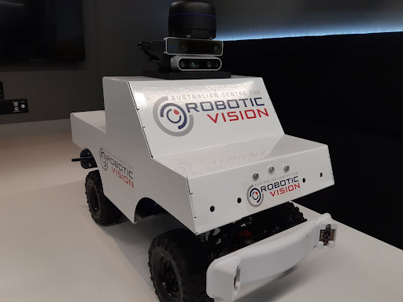

# Carlie Documentation

Thank you for your support by utilising the Carlie platform. It has been designed to simplify autonomous car research, education and to help facilitate engaging demonstrations. We hope it makes these areas of your life as simple as possible.

<figure float="center" style="margin-bottom: 2em; display: block; text-align: center">
    
</figure>

Features of the platform include:
* Integrated IMU with Velocity and Steering Angle Feedback
* GPS Capabilities
* Easy control options, with hassle-free transition between Tele-Operation and Autonomous modes
* Onboard 5G WiFi Router with Accessible Ethernet port
* Out-of-the-box demos and capabilities, such as LIDAR SLAM

The hardware on the platform includes:
* [NVIDIA TX2 Jetson](https://developer.nvidia.com/embedded/jetson-tx2) with [Auvidea J120 Carrier Board](https://auvidea.eu/j120/)
* [Slamtec A3 RPLIDAR](https://www.slamtec.com/en/Lidar/A3)
* Intel Realsense [D435 Depth](https://www.intelrealsense.com/depth-camera-d435/) and [T265 Tracking](https://www.intelrealsense.com/tracking-camera-t265/) Cameras

## Getting Started

Below are links to documentation that will help you utilise Carlie. If you are Getting Started with the platform we would recommend you read the [Power Management](pages/power_management), [Starting Up Carlie](pages/starting_up_carlie), [Networking Interfaces](pages/carlie_networking_interfaces), [Calibrating and Configuring Carlie](pages/carlie_config_and_calibration) and [Running Existing Demos/Capabilities](pages/carlie_running_existing_capabilities) in that order. If you are wanting to explore the Carlie platform in more detail check out [The 3 Levels of Carlie]() and the [Carlie Software Page]().

## Table of Contents

* [Power Management](pages/power_management)
* [Starting Up and Driving Carlie](pages/starting_up_carlie)
* [Networking Interfaces](pages/carlie_networking_interfaces)
* [Running an Existing Demo/Capability](pages/carlie_running_existing_capabilities)
* Installing and Updating Carlie Software
* The 3 Levels of Carlie
* Carlie Software