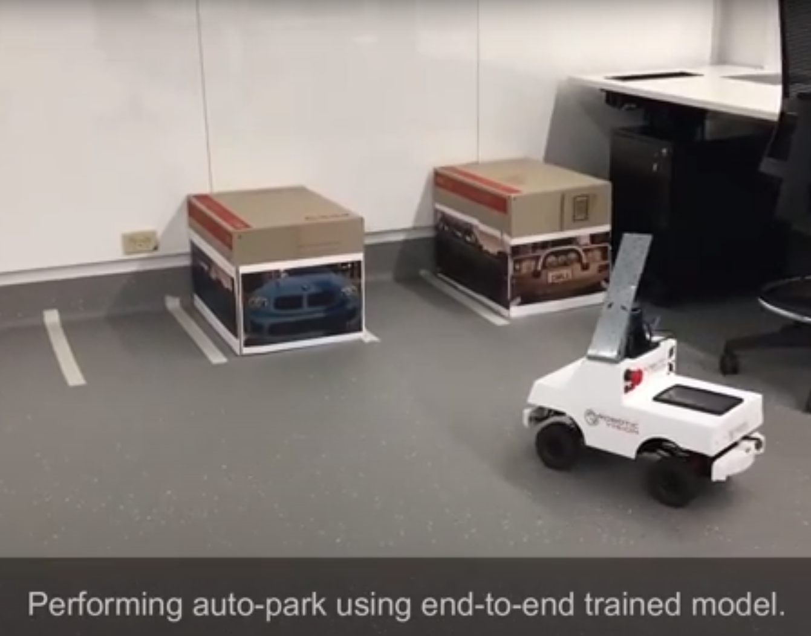
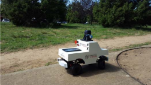
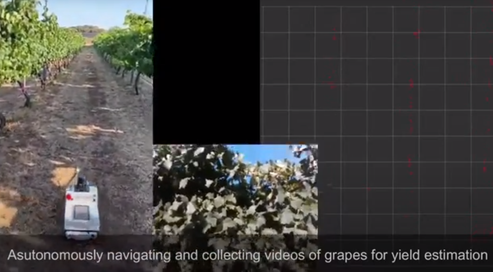

# RoboVis 2020 - Showcase Competition

The Carlie Showcase Competition, to be held at ACRV RoboVis 2020, is a chance to show the world how you utilised the Carlie platform in an exciting, innovative or compelling research activity or public demonstration. There are **cash prizes up for grabs**.

Any questions please contact James Mount (j.mount@qut.edu.au). For our Melbourne based colleagues there is the option to work with James on a remote demo.

<figure float="center" style="margin-bottom: 0.2em; display: block; text-align: center">
    
    
</figure>
<figure float="center" style="margin-bottom: 2em; display: block; text-align: center">
    
</figure>

## Key Dates

All times are in Australian Eastern Standard Time (AEST) (i.e. Queensland Time).

- 9.00am Monday 9th November: Nomination deadline
- 5.00pm Tuesday 24th November: Presentation documents deadline
- 3.45pm Thursday 26th November: Show Time

## Prizes

- First Place: $500
- Second Place: $150
- People's Choice: $100

## The Format

The Carlie Showcase will require you to present the work you utilised the platform for in a 3-5 minute engaging presentation. Your presentation will be assessed by an independent panel of judges. The criteria will consist of:

- the quality of your research activity or you public demonstration, and how you utilised Carlie to help you with your goal; and
- the quality of your presentation - how clearly you articulate your ideas and how engaging is your presentation.

More detailed criteria will be made available shortly. While live demonstrations are always a pleasure to watch they are not necessary and no "extra marks" will be awarded for a live demonstration, but videos are highly encouraged. 

## The Panel

The panel will be announced at a later date.

## The Nominations

To nominate please fill out the following form.

<iframe style="width: 100%; height: 55em; margin: 0 auto;" src="https://docs.google.com/forms/d/e/1FAIpQLSdTuPpxdQ8Kk0sFvviIXIoKVwXMuP8IAC8rHusO_ftFtyhORA/viewform?embedded=true" frameborder="0">Loading…</iframe>

    
