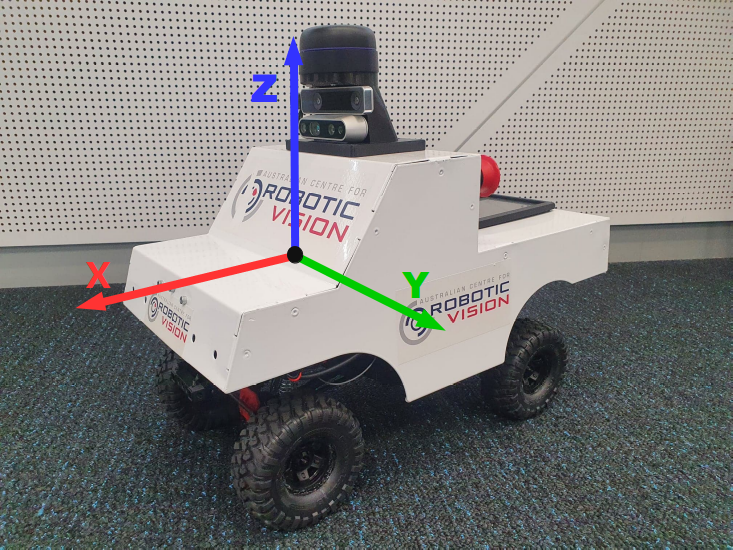
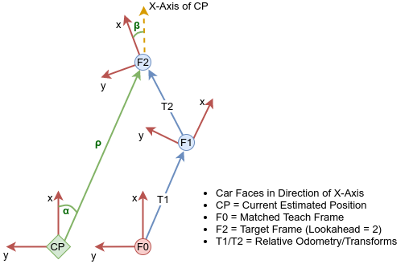

# RoboVis 2020 - Vision Challenge (Hack-A-Thon) Details

Thank you for participating in the RoboVis 2020 Carlie Vision Challenge (Hack-A-Thon). Your task is to develop a vision algorithm that can help Carlie autonomously navigate a route that it has previously driven. This is known as teach and repeat. In the teach stage Carlie will be manually driven to traverse a route, collecting image and odometry data along the way. You will then return Carlie to the starting position and run your vision algorithm, comparing the current image against those taken during the teach phase, in order to determine where you are. Control commands will then be generated to enable Carlie to autonomously traverse the route. You only need to create the vision algorithm, all the other parts have been created. We have even provided you with an initial image matching algorithm based on normalised cross-correlation, a template matching algorithm. 

The approximate steps you will take to complete the challenge are as follows:

1. Prepare Carlie  - *Can be performed as a whole node* **(once off)**
3. Run example on Carlie - *Can be performed as a whole node*
2. Fork Repo and Make Some Changes - *performed as a team/individual* **(once off)**
4. Develop your Image Matching Algorithm on your PC using the supplied datasets - *performed as a team/individual*
5. Transfer your Image Matching Algorithm to Carlie - *performed as a team/individual*
6. Test, Refine, Test some more - *performed as a team/individual*

The first two steps can be performed as a whole group at each node. The remaining steps will be performed as a team/individual. We know there are a lot of steps laid out below, and it might be a little off-putting. However, the steps are really explicit and quite quick to run. You should be developing your own algorithm within one to two hours depending on how familiar you are with the various processes (i.e. github, ros etc.).

If you have any issues throughout the day, please check out the [FAQ](#frequently-asked-questions), the dedicated channel on the [ACRV Slack workspace](https://acrv.slack.com) or get in contact with James Mount (j.mount@qut.edu.au).

## Step 1: Preparing Carlie for the Challenge

ONCE OFF - CAN BE PERFORMED AS A WHOLE GROUP AT EACH NODE

First we need to ensure your Carlie platform is good to go, with its keyboard, mouse and Logitech gamepad at the ready. You will also need to have the default sensor suite installed (see [The Sensor Layer](../pages/3_levels_of_carlie#the-sensor-layer)) and be running the latest carlie software, instead of the original nightrider software. To upgrade the car to the carlie software please open up a terminal and run the following commands:

    sudo apt update
    sudo apt install ros-melodic-carlie

After running those commands, reboot Carlie and attempt to drive the platform once it has rebooted (see [Driving Carlie](../pages/starting_up_carlie#driving-carlie)). You will also need to make sure that a ROS catkin workspace exists. The default place is `/home/nvidia/catkin_ws` **but it may be somewhere else** (check with someone who has used the platform before). You can create a new ROS catkin workspace if you want as well. If a ROS catkin workspace does not already exist, or you want to create a new one, create it by running the following commands:

    mkdir -p ~/catkin_ws/src
    cd ~/catkin_ws/
    catkin_make

You will also probably want to source this workspace within your `~/.bashrc`, otherwise you will need to source your workspace each time you open up a new terminal. To do this perform the following:

    echo "source /home/nvidia/catkin_ws/devel/setup.bash" >> ~/.bashrc
    source ~/.bashrc

The final step is to clone the Carlie teach and repeat ros package to your catkin_ws and install dependencies. Run the following commands to achieve this:

    cd ~/catkin_ws/src
    git clone https://github.com/RoboticVisionOrg/carlie_teach_and_repeat.git
    cd ~/catkin_ws
    rospack profile
    rosdep install --from-paths src --ignore-src -r -y
    catkin_make

## Step 2: Run The Example on Carlie

CAN BE PERFORMED AS A WHOLE GROUP AT EACH NODE

To run the teach and repeat framework you will perform the following steps:

1. Start up the D435 RGB-D and T265 Pose cameras and check they are working
2. Run the teach phase. This will save images and odometry data
3. Preprocess the teach phase images ready for the repeat phase
4. Run the repeat phase and hope for the best :)

### Step 2.1: Start the Two Cameras
We will now run the teach and repeat example. To start we will get the two Realsense cameras up and running. To start the cameras run the following commands:

    roslaunch carlie_sensors carlie_sensors.launch laser_enabled:=false

Sometimes the realsense cameras do not seem to start up correctly. It is something to do with their internal hardware and software. We are trying to fix this, but currently the only solution is to unplug and replug in the camera that isn't working or `ctrl+c` the command and relaunch. To check to see if the D435 RGB-D camera is working (the bottom camera), run the following in another terminal:

    rostopic echo --noarr /rgbd_camera/color/image_rect_color

If data/messages start appearing in your terminal, sometimes it takes 1-2 seconds, then the RGB-D camera is good to go. To check the T265 Pose camera (the top cameras), run the following command:

    rostopic echo --noarr /pose_camera/odom/sample

If data/messages start appearing in your terminal, sometimes it takes 1-2 seconds, then the Pose camera is good to go as well. You need both cameras good to go before you can go onto the next step.

### Step 2.2: Teach Phase
The first step is to run the teach phase. Place Carlie on the floor, if it isn't already, and make sure you can teleop Carlie using the Logitech Gamepad (see [Driving Carlie](../pages/starting_up_carlie#driving-carlie)). You may also wish to roughly mark the starting position (e.g. place a post-it note next to a wheel). Then run the following command:

    roslaunch carlie_teach_and_repeat teach.launch

Wait until the terminal says `Press B on the Gamepad to Start Recording`. Press B on the Gamepad and start driving. Carlie will save an image approximately every 0.25m as well as the odometry between frames. Drive a simple route that does not have tight corners, and try to keep away from obstacles. The starting and ending points of the route do not need to be the same. Press B once you have driven your route to stop recording data, this will terminate the node. The images and the odometry data will be saved in the directory `/home/nvidia/route_1`. **Note**: the `dataset.txt` file will not show anything until the recording is completed (i.e. B is pressed for a second time). 

Sometimes image data does not get through the ROS message pipeline, or is corrupted. Therefore, I would recommend you open the `/home/nvidia/route_1` directory and click on the first image (`frame_000000.png`) and then using your arrow keys navigate through all the images making sure there is only a small jump between consecutive images. Trust me you will know if there is a significant jump in your teach dataset.

### Step 2.3: Preprocess Teach Images
We now need to preprocees the teach images. To do this run the following:

    rosrun carlie_teach_and_repeat preprocess_teach_images ~/Documents/route_1/dataset.txt

This `preprocess_teach_images` script is taking in a path to a teach dataset file and will produce a new route directory with _processed appended (e.g. route_1 will become route_1_processed) which will contain the preprocessed images and a copy of the dataset.txt.

You will most likely need to modify this script to run your own preprocessing steps. However, we will get to that later.

### Step 2.4: Repeat Phase

It is now time to run the repeat phase. Return Carlie to the starting position and run the following command:

    roslaunch carlie_teach_and_repeat repeat.launch

Now hold down the autonomous e-stop button (left bumper), but be ready to take your finger off at any moment. Also, stay close to Carlie that Gamepad only has a range of about 5-10m. Hopefully Carlie will autonomously navigate the route. The current example does have problem with tight corners, corners in general can be troublesome for teach and repeat. We will explain how the example works a little later on.

Turn off Carlie, we will come back to using it later. Remember to put the batteries onto charge.

## Step 3: Fork the Carlie Teach and Repeat Package and Change The Name
The next step can be done on your personal PC. First you will need to fork the Carlie teach and repeat repo. To fork the repo perform the following:

1. Go to the original repository [here](https://github.com/RoboticVisionOrg/carlie_teach_and_repeat) and click the Fork icon on the right hand side of the screen
2. Fork the repo to your personal github account
3. In the forked repo, go to settings -> options
4. **IMPORTANT** Append your team name or individual name (just some unique identifier) to the reposiory name (e.g. carlie_teach_and_repeat_jmount) 

Step 4 is essential. It will make sure we don't end up with name clashes when every team/individual starts using Carlie. It will also make my life easier when I evaluate your algorithms :). 

## Step 4: Develop Your Image Matching Algorithm
It is preferable you develop your image matching algorithm on your personal PC first, before running it on Carlie, using the supplied datasets. This will speed up development. However, this does require that you are using Ubuntu 16.04 or later and have ROS Kinetic, Melodic or Noetic installed. If you don't have ROS, it can easily be installed in approximately 10 minutes. If you are on Ubuntu 16.04 install Kinetic, Ubuntu 18.04 install Melodic, and for Ubuntu 20.04 install Melodic or Noetic (Melodic is what is running on Carlie so that would be preferable). Instructions can be found [here](http://wiki.ros.org/ROS/Installation). If you don't want to install ROS you can work on Carlie, but remember other teams/individuals will want access to it at some point during the day. 

**Important**: The Carlie platform does not have a large amount of storage space so keep an eye on how much free disk space you have. You might need to delete old logs (stored in `~/.ros/log`) or old datasets (images or rosbags).

**Important**: We will use the term teach or reference images/frames to refer to images from the teach phase, and repeat or query images/frames to refer to the images during the repeath phase.

### Setup Up Your Development Machine
If you are working on your own development PC setup a ROS catkin workspace if you do not already have. Run the following commands if you need to create a ROS catkin workspace (**these commands can be skipped if you are on Carlie**):

    mkdir -p ~/catkin_ws/src
    cd ~/catkin_ws/
    catkin_make

You will also probably want to source this workspace within your `~/.bashrc`, otherwise you will need to source your workspace each time you open up a new terminal. To do this perform the following (**these commands can be skipped if you are on Carlie**):

    echo "source /home/nvidia/catkin_ws/devel/setup.bash" >> ~/.bashrc
    source ~/.bashrc

You need to add the ACRV key to your sources list to install software created by ACRV (i.e. Carlie packages). First import the RV GPG Key using the following command (**these commands can be skipped if you are on Carlie**):

    sudo -E apt-key adv --keyserver hkp://keyserver.ubuntu.com --recv-key 5B76C9B0

Add the Robotic Vision repository to the apt sources list directory (**these commands can be skipped if you are on Carlie**):

    sudo sh -c 'echo "deb [arch=$(dpkg --print-architecture)] http://roboticvision.org/packages $(lsb_release -sc) main" > /etc/apt/sources.list.d/acrv-latest.list'

Update your packages list:

    sudo apt update

We now need to resolve rosdep issues. Run the following command (**these commands can be skipped if you are on Carlie**):

    sudo sh -c 'echo "yaml https://bitbucket.org/acrv/rv_package_list/raw/HEAD/$(lsb_release -sc)/sources.yaml" >> /etc/ros/rosdep/sources.list.d/20-default.list'
    rosdep update

**Note**: This command assumes that you have previosly installed ROS and have run rosdep init

Now clone your forked carlie_teach_and_repeat repo to your ROS catkin workspace. For example:

    cd ~/catkin_ws/src/
    git clone https://github.com/<YOUR_GITHUB_USERNAME>/carlie_teach_and_repeat_<YOUR_UNIQUE_ID>.git

Before we do anything else we need to make some minor edits to reflect the name change, else the build process and ROS launch files will be incorrect. These steps are absolutely essential:

1. Open up the CMakeLists.txt file and change line 2 from `project(carlie_teach_and_repeat)` to `project(carlie_teach_and_repeat_<YOUR_UNIQUE_ID>)`
2. Open up the package.xml file and change line 3 from `<name>carlie_teach_and_repeat</name>` to `<name>carlie_teach_and_repeat_<YOUR_UNIQUE_ID></name>`
3. Open up each file in the launch directory and change the pkg value within the node XML tag (line 6) from `<node pkg='carlie_teach_and_repeat' ...` to `<node pkg='carlie_teach_and_repeat_<YOUR_UNIQUE_ID>' ...`

Then run the following commands:

    cd ~/catkin_ws
    rospack profile
    rosdep install --from-paths src --ignore-src -r -y
    catkin_make

Now before you go run off hacking together your solution we will take a quick look at what we have already provided for you. This will include looking at the provided files, the current parameters and running through the current example. This hopefully will help you understand exactly what you need to do.

### The Provided Files
The provided ROS launch files are: 

- `launch/teach.launch` - a ROS launch file used to start the teach node and pass through your desired parameters. Use this launch file on the Carlie platform.
- `launch/teach_desktop.launch` - a ROS launch file used to start the teach node and pass through your desired parameters. Use this launch file on your development PC. It is a copy of the teach.launch file with a minor change in the parameters to make it easier to run stuff on your development PC and so you don't need to keep changing parameters when going between your development PC and Carlie. The *base_path* and *use_gamepad_for_recording_signal* are the two parameters that are different when compared to the teach.launch file.
- `launch/repeat.launch` - a ROS launch file used to start the repeat node and pass through your desired parameters. Use this launch file on the Carlie platform.
- `launch/repeat_desktop.launch` - a ROS launch file used to start the repeat node and pass through your desired parameters. Use this launch file on your development PC. It is a copy of the repeat.launch with some parameter changes. The *teach_dataset* and *save_repeat_dataset* parameters have been altered when compared to the repeat.launch file.

The provided scripts are:
- `scripts/teach` - the teach node used to record images and odometry data.
- `scripts/repeat_example` - the repeat node example used to match frames and generate autonomous control commands.
- `scripts/repeat` - the repeat node used to match frames and generate autonomous control commands. This is where your focus will be and has write your own code here comments.
- `scripts/preprocess_teach_images` - used to preprocess teach images ready for the repeat phase. You will need to add your own preprocessing steps, if you have any.
- `scripts/plot_teach_data` - a script that you can use to plot dataset files.

Some helper files:
- `src/teach_repeat/teach_repeat_common.py` - a Python module which contains common functions.
- `src/teach_repeat/transform_tools.py` - a Python module which contains functions to manipulate transformation matrices.

### The Provided Parameters
We will now quickly go through the parameters in the `teach_desktop.launch` and `repeat_desktop.launch` files, and make some edits while we are here. We will only look at the parameters, the ones that start with `<param name= ...`. 

The teach_desktop.launch file parameters are:

- `max_forward_velocity` - this sets the maximum forward speed for Carlie. We recommend you keep this at 0.5 m/s.
- `keyframe_distance_threshold` - this sets how far should Carlie approximately travel before saving a new teach frame. Leave this at 0.25m for now but you may wish to tweak this later.
- `save_image_resize_x` and `save_image_resize_y` - these parameters set the resolution the teach images should be saved. Note the images coming from the camera are 640x480. So currently these parameters don't actually do anything as they are set to 640 and 480.
- `base_path` - the base path where you want your teach datasets to be saved to. This base path will be appended with the route_name parameter. Go ahead and change the value for the base_path parameter now to point to a directory on your development PC. 
- `route_name` - the name you wish to give to the teach route. This will be appended to the base_path parameter. If you wish to have two different teach routes you can record one with the parameter value set to route_1 and then record the second after changing the parameter value to route_1. You can leave this as route_1 for now.
- `visualisation_on` - set to true if you wish to see the most recent teach image saved. Currently set to true.
- `use_gamepad_for_recording_signal` - used to specify if you wish to use the B button on the Logitech Gamepad to start and finish recording the teach dataset. This is useful on the car, but not on a development machine.

The repeat_desktop.launch file parameters are (will only go through the parameters not also in the teach_desktop.launch file):

- `process_every_nth_frame` - used to specify if you wish to process only every nth image coming from the camera. For example, setting this to 10, will only compare every 10th image to the teach dataset. Note the camera outputs images at approximately 30Hz. 
- `teach_dataset` - used to specify the path to the teach dataset you wish to compare to. Note this must point to the dataset.txt file and not just the directory. You will want to change the value for this parameter.
- `x_offset_scale_factor`, `y_offset_scale_factor` and `yaw_offset_scale_factor` - can be used to scale the x-, y- and yaw-offsets generated by your image matching algorithm. The meaning of these parameters will become clearer when we go through the example. You will need to change these while you develop your own image matching routine.
- `frame_search_window` - used to specify the local teach dataset search space window. For example, if your previous iteration of your image matching algorithm determined that the 10th teach frame was the best match, then this iteration of your image matching algorithm will look at the teach frames within +/-w of the 10th frame. This is a good way to reduce matching to incorrect locations due to perceptual aliasing (images from different places looking the same) as well as to reduce the number of teach frames that need to be compared to (i.e. reduces computational load).
- `image_comparison_size_x` and `image_comparison_size_y` - used to specify the size wish to reduce the incoming images to before comparing them to the teach dataset. You may or may not need this parameter in your image matching algorithm.
- `patch_portion` - this parameter is fairly specific to the example image matching algorithm. It defines what portion of the incoming image to crop from the center to use as the template in the normalised cross-correlation comparison. The meaning of this parameter will become clearer when we run through the example.
- `target_frame_lookahead` - used to tell the controller how far to lookahead in the teach dataset given the current matched frame. This target frame is used to determine the distance to the target frame (rho), angle to the target frame (alpha) and heading of the target frame (beta). You may wish to tweak this once you have developed your image matching algorithm.
- `rho_gain`, `alpha_gain` and `beta_gain` - the proportional gains for the rho, alpha and beta components. Used to determine the control commands (forward speed and steering angle). You may wish to tweak this once you have developed your image matching algorithm.
- `save_repeat_dataset` - used to specify if wish to save the repeat dataset. We recommend you only have this set to true on your desktop PC and not on Carlie. It will produce 30 images per second, if the process_every_nth_frame parameter is set to 1, which could quickly fill up Carlie's disk space if you are not careful. If you set this to true remember to true make sure the base_path in the repeat_desktop.launch file is correct.

### The Provided Image Matching Algorithm Example
We shall now go through the example image matching algorithm. Open up `scripts/repeat_example` in your favourite editor. This script is a ROS node and we typically write my ROS nodes as classes. Scroll down to the `ImageMatching` function, line 201. This function takes in a image, in BGR format, as well as a 4x4 transformation matrix that is relative to the previous query image. 

At the core of the example image matching algorithm is normalised cross-correlation, a [template matching](https://docs.opencv.org/master/d4/dc6/tutorial_py_template_matching.html) technique. Normalised cross-correlation takes a template and compares this to an image by sweeping the template across the image. The result is a matrix where the maximum value of the matrix indicates the best location of the template within that image. We perform normalised cross-correlation between the repeat image and a subset of the teach dataset (based on the previously matched teach frame) and take the maximum correlation score and location. This process is contained within the for loop from lines 220 to 233.

The repeat template is generated by first preprocessing the repeat image, in this case converting to grayscale and resizing the image (lines 209 and 210). A center portion of the image is then cropped out to create the repeat template (line 213). This template is compared against all teach frames within a local window of the previously matched teach image (lines 220 to 233). 

Once the best teach frame has been determined. We need to determine the approximate offset of the repeat frame relative to matched teach frame. This is performed on lines 242 to 248. As we used normalised cross-correlation we get the horizontal offset between the matched teach and repeat frames. This offset though is in pixels and so we need to convert this to metres. To do this we multiply the horizontal offset by the y_offset_scale_factor, a tuned parameter, that causes the result of the multiplication to be roughly in metres. In this example we assume the repeat image only has a horizontal offset (y-offset) relative to the matched teach frame. (i.e. the repeat frame is only left or right of the teach frame position and that Carlie is not in front/behind the matched teach frame or rotated). Obviously this assumption is violated regularly, but it as you saw it works well enough. However, removing this assumption, or at least relaxing it, would result in better performance.

The offsets created (line 248) are then shipped off to the controller function to determine the control commands (forward velocity and steering angle).

### Your Image Matching Algorithm
Now it is your turn to create your own repeat phase algorithm. You will predominantly be focussing on the image matching algorithm/function. Open up the repeat file and you will note there are some lines with `### ADD YOUR OWN CODE HERE ###`. There are two within the `__init__` function, these can be ignored for now, and one within the `ImageMatching` function. This is where you will want to start. Effectively your algorithm will be a two step process:

1. Firstly given a new repeat image you want to determine the best matching teach frame.
2. Once you have determined the best matching teach frame you need to determine the offsets, at minimum the horizontal offset, between the repeat image and the matched teach frame.

Effectively, what is happening is that step 1 tell us where we are along the teach path, and step 2 corrects for lateral deviations off the teach path. As Carlie uses ROS Melodic only Python2 is available to us. We did try getting a Python3 config up and running for this challeng using catkin_virtualenv, but unfortunately catkin_virtualenv with Python3 is pretty experimental.

**Supplied Datasets**: Some datasets (ROSbags) can be downloaded [here](https://cloudstor.aarnet.edu.au/plus/s/ZNPERcqbZ8a1LZO) to initially help you test your image matching algorithm on your desktop machine. Each rosbag is approximately 1GB. 

#### Rules, Assumptions and Some Hints
In terms of what rules and sensory data you are allowed to use:
1. If you need to install a Python package and it is pip installable, please add it to the requirements.txt file within your teach and repeat package. If you need to install some other software please adequately document the process.
2. You can perform whatever preprocessing steps you like on the teach images, as long as it runs within a reasonable time frame (e.g. 5 minutes). 
3. You can use the relative odometry transformation matrix provided, but no other position information (e.g. LiDAR-based localisation).
4. You can use the RGB and Depth images coming from the D435 camera. You will need to add in a subscriber to get the depth image.

You are allowed to make the following assumption:
1. Carlie will always be placed approximately at the start of the route when running the repeat phase.

Some things you may wish to consider:
1. Can you get the x- and yaw-offsets between the repeat image and the matched teach frame?
2. How can you use the odometry information to help inform the image matching algorithm? 
3. Can the odometry information help determine offset information?

#### Testing Your Algorithm (On Your Develpoment Machine not Carlie)
To test your algorithm you will first need to make a quick edit to both the `repeat.launch` and `repeat_desktop.launch` files. In both files change the type value in the node XML tags to from `repeat_example` to `repeat` (line 6). For example, change from:

    <node pkg="carlie_teach_and_repeat_YOUR_UNIQUE_ID" type="repeat_example" name="repeat_node" output="screen">

To:

    <node pkg="carlie_teach_and_repeat_YOUR_UNIQUE_ID" type="repeat" name="repeat_node" output="screen">

This means when you run `roslaunch carlie_teach_and_repeat_YOUR_UNIQUE_ID repeat.launch` it will execute the repeat script rather than the repeat_example script. Remember to set appropriate path parameters in the launch files. 

Now we need to create a teach dataset from the supplied datasets. First open up a terminal and launch the teach phase:
    
    roslaunch carlie_teach_and_repeat_YOUR_UNIQUE_ID teach_desktop.launch

Now, in a second terminal, run one of the supplied datasets using the rosbag play functionality
    
    rosbag play <path_to_supplied_dataset>

Once the rosbag has finished playing run the teach preprocessing script (remember you will need to make changes to this script).

    rosrun carlie_teach_and_repeat_YOUR_UNIQUE_ID preprocess_teach_images <path_to_teach_dataset_text_file>

We are now ready to test your repeat algorithm. Run the following command:

    roslaunch carlie_teach_and_repeat_YOUR_UNIQUE_ID repeat_desktop.launch

Now, in a second terminal, run one of the supplied datasets. Make sure you select a suitable bag to run (i.e. if your teach path was created using route_1_run_a.bag, use route_1_run_a.bag or route_1_run_b.bag as your repeat data but not a bag from another route):

    rosbag play <path_to_supplied_dataset>

Keep refining and testing until you are happy with your image matching algorithm and are ready to test on Carlie. 

## Step 5: Test Your Algorithm on Carlie
Once you are ready of testing your algorithm on Carlie it should be as simple as running the following commands on Carlie:

    cd ~/catkin_ws/src/
    git clone <your_forked_carlie_teach_and_repeat_repo>
    cd ~/catkin_ws
    rospack profile
    rosdep install --from-paths src --ignore-src -r -y
    catkin_make

Then run through the following steps, remember to use `carlie_teach_and_repeat_YOUR_UNIQUE_ID` instead of `carlie_teach_and_repeat` in the commands:

1. Start the cameras - see [Step 2.1](#step-21-start-the-two-cameras) as a guide
2. Run the teach phase - see [Step 2.2](#step-22-teach-phase) as a guide
2. Preprocess the teach images - see [Step 2.3](#step-23-preprocess-teach-images) as a guide
2. Run the repeat phase - see [Step 2.4](#step-24-repeat-phase) as a guide

## Submission and Evaluation

Please send James (j.mount@qut.edu.au) a link to your forked carlie_teach_and_repeat repository before 5pm (AEST) Monday 23rd of November. He will clone your repo and evaluate its performance on Tuesday 24th November. You are also required to provide some short documentation explaining your algorithm. You can find an example in the original carlie_teach_and_repeat repo [README.md](https://github.com/RoboticVisionOrg/carlie_teach_and_repeat/blob/master/README.MD).

## Extensions (Bonus Marks)
As we have no idea how far you will get here are some extension that you can attempt.
1. Remove the assumption that Carlie will place back at the start of the route on the repeat phase. This means you will need to perform global localisation at least in your first iteration.
2. Create a circular teach path and have Carlie be able to repeat it continously.
3. Have Carlie drive the path in reverse. Carlie can either be facing the other way, or drive it in reverse gear.

## Frequently Asked Questions

We will add any frequently asked questions that occur throughout the challenge here. Check this space first when you get into trouble, then checkout the dedicated Slack channel in the [ACRV Slack workspace](https://acrv.slack.com).

- **Question**: What is the coordinate frame for Carlie?
- **Answer**: X-Axis is in the direction of travel, Y-Axis is to the left if looking in the same direction and Z-Axis is pointing towards the sky.

<figure float="center" style="margin-bottom: 2em; display: block; text-align: center">
    
</figure>

- **Question**: What do rho, alpha and beta represent in the controller?
- **Answer**: Rho is the distance (m) from the current estimated position to the target frame position. Alpha is the angle (rads) from the current estiamted position to the target frame position. Beta is the angle (rads) from the current estimated heading to the heading of the target frame. The target frame is the position of a teach frame a defined lookahead distance of the current matched teach frame.

<figure float="center" style="margin-bottom: 2em; display: block; text-align: center">
    
</figure>