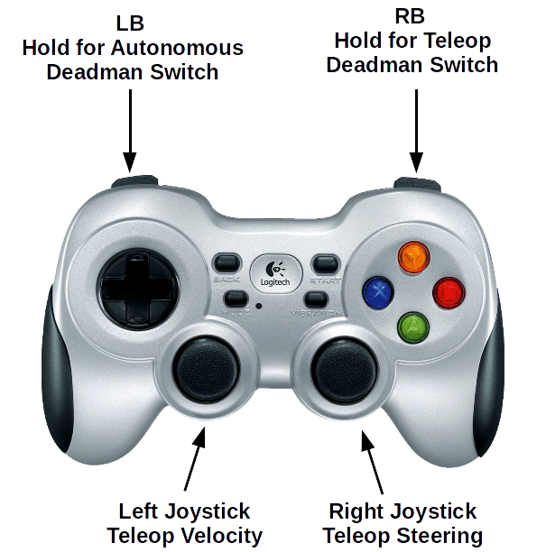
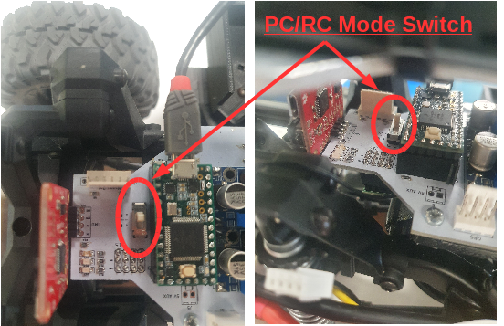

# Starting Up and Driving Carlie

## Turning On Carlie
To turn on Carlie press the *on button* located on the shell. Pressing the on button provides power to all the various systems and automatically turns on the computer. After a short delay (1-2 minutes) the screen will turn on. The default username and password to the computer are both *nvidia*.

As part of the start-up sequence the computer will automatically launch the following systems:

* Carlie Base System - this is required to allow the computer to communicate with the low-level hardware (motion control, IMU, GPS, short-range LIDAR sensors) as well as provides the tele-operation via the gamepad and the hassle-free switch between tele-operation and autonomous modes.
* Carlie Power Monitor - this creates a system tray icon to show the current status of the batteries.

## Turning Off Carlie
To turn off Carlie we recommend you first shut down the computer in the usual fashion. Once the computer has shut down you can press the off button located on the shell. Pressing the off button disconnects power from all the systems. We then recommend you unplug the battery and place it in a LiPo safety bag.

**Note:** if you shut down the computer but forget to press the power button the power system will automatically power off if the battery goes too low. See the [Power Management](power_management) for more information.

## Driving Carlie
Carlie can be controlled in three different ways out-of-the-box. These three ways are:

* Tele-operated via the Logitech F710 gamepad (default),
* Tele-operated via the Traxxas RC Remote that came with the Traxxas Platform (which Carlie is built upon), or
* Autonomously via computer generated control commands.

**IMPORTANT!** Before driving Carlie for the first time using the Logitech F710 Gamepad or the Traxxas RC Remote make sure to check that the neutral steering position for each remote has the wheels pointing approximately straight. This can be done by turning the car on and pressing only the deadman switch, if applicable, and leaving the other control inputs in their neutral position. Then using the steering control attempt to manipulate the wheels, ensuring that when the steering control input goes back to the neutral position the wheels return to pointing straight. If the wheels are point at an extreme angle (e.g. +/-10 degrees off straight) please go calibrate the [center steering angle](../going_further/carlie_config_and_calibration#calibrating-carlie-control-parameters) parameter now as not to cause damage to the steering servo. If the wheels are not quite pointing straight, that is okay for now, you can continue on and fix this later.

### **Tele-Operation via Logitech F710 Gamepad**
A minute or two after the computer has started up you should be able to drive Carlie using the Logitech Gamepad. The Logitech F710 gamepad will need to be in the *D Mode*; the switch can be found on the top edge of the controller. The controls are as follows:

* Right Bumper - is a deadman switch. It must be pressed at all times when tele-operating the robot. Releasing it will stop the vehicle.
* Right Joystick - is used to control the steering.
* Left Joystick - is used to control the linear velocity.

You may notice a slight left or right drift when trying to drive straight, [calibrate the center steering angle](../going_further/carlie_config_and_calibration#calibrating-carlie-control-parameters) parameter to remedy this. 

**SAFETY WARNING!** We have noticed that the gamepad has a reliable range of about 5 metres. After 5 metres there is some extremely noticeable lag and dropout, and releasing of the deadman switch may not result in an immediate stop. If you wish to be further than 5 metres away from the vehicle while tele-operating we recommend using the RC remote instead.

<figure float="center" style="margin-bottom: 2em; display: block; text-align: center">
    
</figure>

### **Tele-Operation via Standard RC Remote**
Carlie can also be operated via the standard RC Remote. While this method does allow for longer range operation, it does mean you cannot have additional capabilities tied to that remote (i.e. a deadman switch or a button to change states etc.). In order to control the platform using the RC Remote you will need to flick the switch that resides next to the Teensy on the Low Level Control Board (white PCB). To do this:

1. Lift up the lid of the platform.
2. Locate the switch next to the Teensy. You will need to look in from the side.
3. Flick the switch. 
4. You should now be able to operate the vehicle using the RC remote.

While the platform is in this mode, which is dictated by the switch, the car can not receive autonomous control commands. This was a design choice due to safety.

<figure float="center" style="margin-bottom: 2em; display: block; text-align: center">
    
</figure>

### **Autonomous Driving**
At some point you will want the car to perform some autonomous actions. We have made the transistion from Logitech tele-operation to autonomous mode hassle-free. To transition from Logitech tele-operation mode to autonomous mode all you need to do is:

1. Bring the car to a halt. 
2. Stop holding the Right Bumper, which we will now call the tele-operation deadman switch.
3. Press and hold the Left Bumper, which we will now call the autonomous deadman switch.
4. If there are autonomous car commands being generated these will be executed instead of the tele-operation commands.

This should allow you to easily switch between tele-operation and autonomous modes and allow you to easily reset experiments. The HSV Blob Following Demo is an example of how you can generate autonomous control commands.

**Note:** for ROS users what we have done is created an exclusive-or multiplexer using the left and right bumpers of the Logitech Gamepad which forwards either the */carlie/ackermann_cmd/teleop* or */carlie/ackermann_cmd/autonomous* down to the low level hardware via the */carlie/ackemann_cmd* topic, depending on which bumper is currently held. All three messages are of type *AckermannDrive*. 