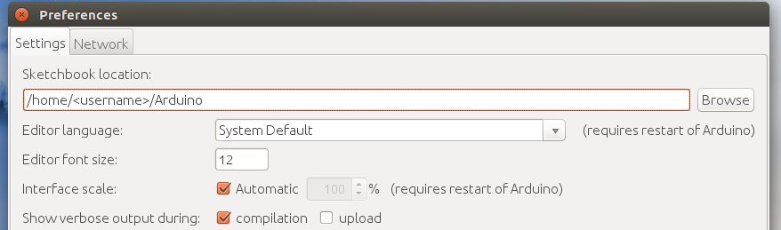
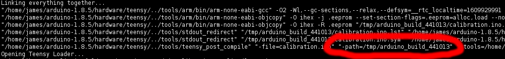

# Developing For Carlie
This page is for those who wish to add features into the official Carlie software stack, or those wishing to fix any issues. We also provide details on how to add your Carlie Application to the official [Carlie Apps](https://github.com/RoboticVisionOrg/carlie_apps) package, and the procedure used for packaging and distributing the official Carlie debians.

The current Carlie software stack consists of four primary ROS packages, these are:

- The [**Carlie Messages**](https://github.com/RoboticVisionOrg/carlie_msgs) - which contains the custom ROS message definitions for Carlie.
- The [**Carlie Hardware**](https://github.com/RoboticVisionOrg/carlie_hw) Package - which contains the firmware for the low-level micro-controller.
- The [**Carlie Base**](https://github.com/RoboticVisionOrg/carlie_base) Package - which contains the scripts for interfacing between the computer and micro-controller, some conversion and filtering nodes and the tools for commanding Carlie. 
- The [**Carlie Sensors**](https://github.com/RoboticVisionOrg/carlie_sensors) Package - which contains the ROS launch files for starting the default Carlie sensor suite.

The methodology for providing feature updates or bug fixes is dependent on the core Carlie package you wish to alter. We provide updating methodologies for each core Carlie package below. Once you have altered a core Carlie package and tested them make a pull request.

## Reporting Issues
If you have problems with installing or running any of the Carlie softare please report an issue using Github's Issues within the appropriate package. For example, if the problem is in *carlie_base* please report at [Carlie Base Package Issues](https://github.com/RoboticVisionOrg/carlie_base/issues). If you are unsure which package is causing the issue please report the issue at [Carlie Package Issues](https://github.com/RoboticVisionOrg/carlie/issues).

If you do find and issue and have a software patch, or if you have developed a feature(s) that you wish to include in the carlie packages, please check out the [Developer Section](../going_further/developing_for_carlie) on how to do this.

## Updating Carlie Messages
If you wish to add in a new Carlie custom message or alter an existing on please follow this procedure below. Please note if you alter the *CarlieConfig.msg*, *CarlieRawOdom.msg*, *CarlieRawMotionData.msg*, *CarlieRawProximityData.msg* or *CarlieStatus.msg* you will need to make changes to the Carlie Hardware and Carlie Base packages. 

1. Git clone the carlie_msgs package into the `src` folder of your ROS catkin workspace, `cd <catkin_ws>/src/ && git clone https://github.com/RoboticVisionOrg/carlie_msgs.git`
2. Create and checkout a new branch with an appropriate name `git checkout -b <branch_name>`
3. Make your changes and run catkin_make on your ROS catkin workspace to make sure your changes build correctly, `cd <catkin_ws> && catkin_make`
4. Run `rospack profile` to ensure ROS will default to the newly cloned repository and not the carlie_msgs package within `/opt/ros/<distro>/`
5. Update the carlie_hw and carlie_base packages, if required
6. Test your changes
7. Once successfully tested submit a pull request 

## Updating Carlie Hardware
You will need to have the [Arduino IDE](https://www.arduino.cc/en/software) installed with the [Teensyduino](https://www.pjrc.com/teensy/teensyduino.html) add-on to be able to modify the firmware for the micro-controller. Make sure in *Arduino IDE > File > Preferences* that the *Sketchbook location* file path points to `/home/<username>/Arduino` and that the *compilation* checkbox is ticked for the *Show verbose output during* option. 

<figure float="center" style="margin-bottom: 2em; display: block; text-align: center">
    
</figure>

To start you will need to clone the carlie_hw repository to a suitable location.

1. Git clone the carlie_hw package into any location on your computer, `cd <desired_location> && git clone https://github.com/RoboticVisionOrg/carlie_hw.git`
2. Navigate into the newly cloned carlie_hw git repo `cd <path>/carlie_hw` 
3. Create and checkout a new branch with an appropriate name `git checkout -b <branch_name>`

Navigate into the cloned carlie_hw package and run the `ArduinoLibrarySymlinkSetup.sh` script. This will create a symbolic link between the folders located in `<path>/carlie_hw/src/libraries` within `~/Arduino/libraries/` folder. This is required so the Arduino IDE can find the carlie, sc_servo and vesc_uart source files. 

Now compile all ROS messages into a library that the Arduino software can use. To do this perform the following:

1. Navigate to the Arduino libraries folder, `cd ~/Arduino/libraries`
2. Remove the ros_lib folder if present, `rm -rf ros_lib`
3. Create the ros_lib folder by executing `rosrun rosserial_arduino make_libraries.py ~/Arduino/libraries`
4. Restart the Arduino IDE, so it reloads the libraries directory

Modify the carlie, sc_servo or vesc_uart library source files and recompile the firmware and calibration hex files. This can be done by:

1. Opening up the appropriate source file in your favourite editor and making the required changes
2. Open up `<path>/carlie_hw/src/firmware/firmware.ino` or `<path>/carlie_hw/src/calibration/calibration.ino` file in the Arduino IDE
3. Press the verify button, top left button that is a tick symbol, to compile the software. Fix any errors that occur during compilation
4. Once compilation has completed successfully, upload the new software to the micro-controller and test the changes. This may require making changes to the carlie_base ROS package.

Once the compiled software has been successfully tested, you will need to copy the compiled hex file into the release folder. To do this follow these steps:

1. Open up the `firmware.ino` or `calibration.ino` file in the Arduino IDE and compile the software.
2. In the compile log output search for the line that includes `"../tools/teensy_post_comile" ... "-path=/tmp/arduino_build_<number>" ...`, example shown in the figure below. We will use the path portion in the next step.
3. Copy the `<filename>.ino.hex` file from the path found in the previous step into `<path>/carlie_hw/release/firmware.hex` or `<path>/carlie_hw/release/calibration.hex`. For example, run the command `cp /tmp/arduino_build_<number>/firmware.ino.hex <path>/carlie_hw/release/firmware.hex`
4. Submit a pull request

<figure float="center" style="margin-bottom: 2em; display: block; text-align: center">
    
</figure>

## Updating Carlie Base
Altering the Carlie Base package is typically straight forward, however if you alter the *config_node*, *driver_node* or *power_monitor_node* you may need to update the micro-controller firmware.

1. Git clone the carlie_base package into the `src` folder of your ROS catkin workspace, `cd <catkin_ws>/src/ && git clone https://github.com/RoboticVisionOrg/carlie_base.git`
2. Create and checkout a new branch with an appropriate name `git checkout -b <branch_name>`
3. Run catkin_make on your ROS catkin worskpace, `cd <catkin_ws> && catkin_make`
4. Run `rospack profile` to ensure ROS will default to the newly cloned repository and not the carlie_base package within `/opt/ros/<distro>/`
5. Navigate back to the git repo `cd <catkin_ws>/src/carlie_base` 
6. Make and test your changes
7. Once tested successfully submit a pull request 

## Updating Carlie Sensors
When altering the Carlie Sensors package please follow the procedure below.

1. Git clone the carlie_sensors package into the `src` folder of your ROS catkin workspace, `cd <catkin_ws>/src/ && git clone https://github.com/RoboticVisionOrg/carlie_sensors.git`
2. Run catkin_make on your ROS catkin worskpace, `cd <catkin_ws> && catkin_make`
3. Run `rospack profile` to ensure ROS will default to the newly cloned repository and not the carlie_sensors package within `/opt/ros/<distro>/`
3. Navigate back to the git repo `cd <catkin_ws>/src/carlie_sensors` 
4. Create and checkout a new branch with an appropriate name `git checkout -b <branch_name>`
5. Make and test your changes
6. Once tested successfully submit a pull request 

## Including Your Applications in Carlie Apps
Once you have developed your Carlie Appplication you may wish to include it within the Official Carlie Apps package. To do this you will be required to write some documentation that explains what your application does, how to run it and any requirements, for example additional sensors required or additional libraries that need to be installed. You can also create a web interface to make your application launchable via a web browser. To include your application within the official set perform the following:

1. Git clone the carlie_apps package into the `src` folder of your ROS catkin workspace, `cd <catkin_ws>/src/ && git clone https://github.com/RoboticVisionOrg/carlie_apps.git`
2. Run catkin_make on your ROS catkin worskpace, `cd <catkin_ws> && catkin_make`
3. Run `rospack profile` to ensure ROS will default to the newly cloned repository and not the carlie_apps package within `/opt/ros/<distro>/`
3. Navigate back to the git repo `cd <catkin_ws>/src/carlie_apps`
4. Copy across your ROS application package into `<catkin_ws>/src/carlie_aps/`. Depending if you copy, or move, your ROS package, as well if it is in the same catkin workspace, you may need to change the name of your ROS package within the CMakeLists.txt and package.xml files. We recommend prepending the package with carlie_, for example my_demo would become carlie_my_demo.
5. Run catkin_make on your ROS catkin worskpace, `cd <catkin_ws> && catkin_make`. Make sure the catkin_make build process is successful.
6. Create a ROS launch file for your demo if one does not already exist.
7. Try running your application, for example `roslaunch carlie_my_demo demo.launch`

Once you have copied your application into the carlie_apps directory and successfully ran your application, we can start creating the web interface if you wish. To create a web interface follow the steps below. You will need to be familiar with, or willing to learn, HTML, Javascript, CSS and the ROSlib javascript API. However, you can use the existing applications with web interfaces as examples.

1. In your launch file add an argument called `websocket_on` with a default value of false, for example `<arg name="websocket_on" default="false" />`
2. In your launch file add include the launch file for the rosbridge_websocket server only if the websocket_on argument is true, `<include file="$(find rosbridge_server)/launch/rosbridge_websocket.launch" if="$(arg websocket_on)" />`.
3. Copy the `<path>/carlie_apps/hsv_blob_following_demo/module.yml` file into your application package, for example `<path>/carlie_apps/<your_application>/module.yml`. Modify the copied module.yml file to suit your application.
4. Copy the `<path>/carlie_apps/hsv_blob_following_demo/html` folder into your application package, for example `<path>/carlie_apps/<your_application>/html`. Modify the contents of the html folder, mainly the index.html file, to suit your application.
5. Copy the `<path>/carlie_apps/hsv_blob_following_demo/debian` folder into your application package, for example `<path>/carlie_apps/<your_application>/debian`. 
6. Test your web interface by opening up a web browser and going to the IP address of your platform. If are already at the IP address of your platform append `/reload` to reload modules, for example `/http://192.255.255.88/reload`.

Once you have tested your application successfully, by both command line launching and web interface launching if applicable, write a README.md with documentation explaining what your application does, how to run it and any requirements, for example additional sensors required or additional libraries that need to be installed. Once this documentation has been written submit a pull request.

<!-- 
## Packaging Official Carlie Debians

Gavin to provide information
-->