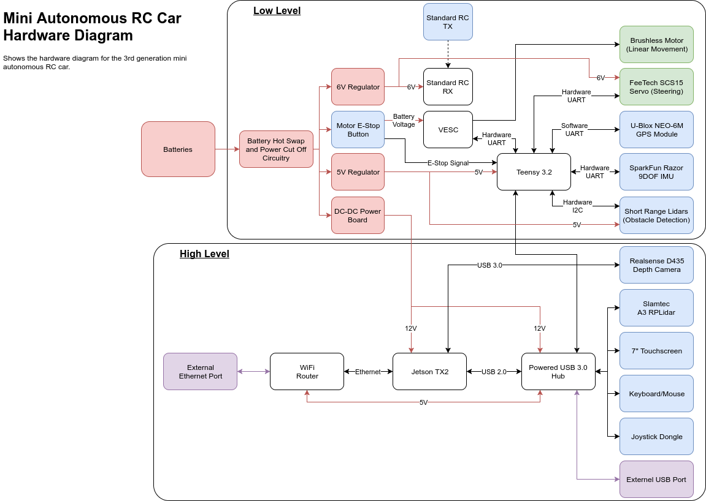
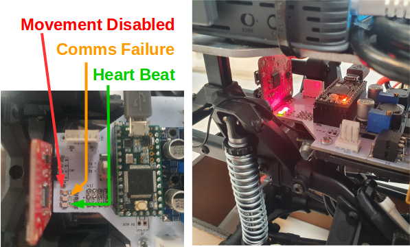

# The 3 Levels of Carlie
The Carlie platform consists of 3 levels in both its hardware and software design. These levels are:

1. The low-level layer
2. The base layer
3. The sensor layer

We have developed these layers to allow you to develop the fourth level, the application layer, as easily as possible. However, we have also developed Carlie with this 3 level principle to allow you to change components easily, such as the computation module or the sensors. Please note, we will sometimes use the term 'high-level' to refer to the combination of the base and sensor layers.

## The Low-Level Layer
The low-level layer consists of all the hardware and software components required to make the platform physically move. This includes:
* A power management system
* A Vedder Electronic Speed Control (VESC) board to manage the brushless motor
* A micro-controller to interface to various low-level hardware components, such as the VESC and GPS
* A tachometer, steering angle, IMU, GPS and proximity sensors
* A control interface via the standard RC remote (meaning a computer does not need to be connected to allow Carlie to be tele-operated)
* A motor emergency stop button

The micro-controller acts as a ROS node and subscribes to the following topics:

* The **/carlie/ackermann_cmd** topic - contains the control values to be performed, such as the linear velocity and steering angle.
* The **/carlie/estop/gamepad** topic - which contains a boolean value specifying if the estop is engaged and that movement should be disabled.
* The **/carlie/teensy/config/set** topic - a topic which is used to set the micro-controller config variables. While this should be setup as a ROS service this is not possible in Arduino.

The micro-controller also publishes to the following topics:

* The **/carlie/imu/raw** topic - which contain IMU data as a string which is converted to the standard IMU message topic in the low-level converter node.
* The **/carlie/odom/raw** topic - which contains the most recent measured linear velocity and steering angle, as well as the raw motion measurement data (tachometer and and motor RPM).
* The **/carlie/teensy/status** topic - contains current status information about the low-level layer, including if movement is enabled and the battery voltage.
* The **/carlie/teensy/config** topic - contains the current configuration values for the low-level.
* The **/carlie/proximity** topic - contains the raw measurements from the four short range LIDAR sensors and the current collision type.

The Carlie platform could have been built without the micro-controller, but this would mean the computer would have been required to connect with all the above sensors listed as well as the VESC. By having a micro-controller take care of these interfaces and to perform some preliminary filtering/analysis of the data, it means that only a single connection is required by the computer to control the movement of the platform. Additionally, this means that the computer can easily be swapped out for a different device and all that is required to control the car is a single USB and the carlie_base ROS package to be installed. The figure below shows how the low- and high-level hardware components are connected. 

<figure float="center" style="margin-bottom: 2em; display: block; text-align: center">
    
</figure>

There are also three LEDs located on the low-level PCB that can potentially help if a problem occurs. 

* **The Green LED** is a heart beat monitor and will flash at approximately 5Hz. If the heart beat LED is ever not flashing a problem has occured within the firmware. 
* **The Yellow LED** will turn on if there is a communication failure between the microcontroller and the controlling PC. A communication failure will occur if the microcontroller has not received the */carlie/estop/gamepad* topic within a specified time period, the default time period is 0.5 seconds. Note, that if Carlie is in RC teleoperation mode this LED will never turn on.
* **The Red LED** will turn on if movement is currently disabled (i.e. if either the button or remote estop are engaged or if there is a communication failure). Note, that if Carlie is in RC teleoperation mode this LED will always be off and movement will always be enabled.

<figure float="center" style="margin-bottom: 2em; display: block; text-align: center">
    
</figure>

## The Base Layer
The base layer contains the computer as well as the ROS software required to communicate with the low-level hardware. Therefore, this base layer controls the movement of the platform via a computer interfacing with the micro-controller on the low-level layer. The base layer consists of the computer and two ROS packages, [**carlie_msgs**](https://github.com/RoboticVisionOrg/carlie_msgs) and [**carlie_base**](https://github.com/RoboticVisionOrg/carlie_base).

The [**carlie_msgs**](https://github.com/RoboticVisionOrg/carlie_msgs) ROS package contains the message definitions for custom topics used to transfer data between the computer and the micro-controller. These message types are:

* The **CarlieConfig** and **CarlieConfigStamped** - contains data/values used to configure characteristics of the platform, such as the maximum velocity.
* The **CarlieRawMotionData** and **CarlieRawMotionDataStamped** - contains raw tachometer and motor RPM values provided by the VESC.
* The **CarlieRawOdom** and **CarlieRawOdomStamped** - contains the current estimate for the linear and angular velocity computed by the micro-controller (the standard ROS odometry message was to data heavy to be passed between the computer and the micro-controller at suitable frequencies).
* The **CarlieRawProximityData** and **CarlieRawProximityDataStamped** - contains the raw proximity data provided by the short range LIDAR sensors.
* The **CarlieStatus** and **CarlieStatusStamped** - contains data/values stating the current state of the low-level system, such as whether movement is currently enabled.

The [**carlie_base**](https://github.com/RoboticVisionOrg/carlie_base) ROS package contains three nodes and a singular launch file. The three nodes are:

* The **config_node** - attempts to set the Carlie config values on the micro-controller to be those specified by the ROS parameter server.
* The **low_level_converter_node** - converts topics coming from the micro-controller that are not in standard ROS message formats, such as the raw odometry data.
* The **driver_node** - is used to pass commands between the computer and the micro-controller. This node listens to the *joy* and */carlie/ackermann_cmd/autonomous* topics and publishes the */carlie/ackermann_cmd*, */carlie/ackermann_cmd/teleop* and */carlie/estop/gamepad* topics. The node also multiplexes the right- and left-bumpers of the Logitech F710 gamepad to enable hassle-free transition between the tele-operation and autonomous modes. If the right-bumper is held-down the */carlie/ackermann_cmd/teleop* topic is copied into the */carlie/ackermann_cmd* topic which is then passed onto the micro-controller. If the left-bumper is held-down the */carlie/ackermann_cmd/autonomous* topic is copied into the */carlie/ackermann_cmd* topic and then passed onto the micro-controller. If both right- and left-bumper or neither button is held down the */carlie/estop/gamepad* topic is set to true and the speed within the */carlie/ackermann_cmd* topic is set to zero.

The *carlie_base.launch* ROS launch file is set to automatically start after the computer is turned on, allowing Carlie to be tele-operated on start-up (assuming you installed carlie_pkgs via apt). The launch file is automatically run **Gavin knowledge**. 

The figure below shows the nodes, topics and connections when the base layer ROS package and microcontroller firmware are running.

<figure float="center" style="margin-bottom: 2em; display: block; text-align: center">
    
</figure>

## The Sensor Layer
The sensor layer contains the sensor suite for Carlie. The default sensor suite consists of a [Slamtec A3 RPLIDAR](https://www.slamtec.com/en/Lidar/A3) and Intel Realsense [D435 Depth](https://www.intelrealsense.com/depth-camera-d435/) and [T265 Tracking](https://www.intelrealsense.com/tracking-camera-t265/) Cameras. These sensors can be started utilising provided launch files in the [**carlie_sensors**](https://github.com/RoboticVisionOrg/carlie_sensors) package.

* The **carlie_sensors.launch** - launches the LIDAR and cameras and is considered the main sensor launch file and includes the 3 launch files below. The file also setups a static transform publisher between the top sensor rig and base link. This launch file also allows you to not start specific sensors via command line arguments. For example, to launch the LIDAR and the depth camera but not the tracking/pose camera you can run the command `roslaunch carlie_sensors carlie_sensors.launch pose_camera_enabled:=false`.
* The **laser.launch** - launches the A3 RPLIDAR as well as a static transform publisher between the top sensor rig and the LIDAR.
* The **d435.launch** - launches the D435 Depth camera with the namespace rgbd_camera, as well as a static transform publisher between the top sensor rig and the camera.
* The **t265.launch** - launches the T265 Tracking camera with the namespace odom_camera, static transform publishers between the top sensor rig and the camera frames and a script which transforms the odometry messages generated by the camera into an odom to base link transform (this is currently used as the odom to base link transform in GMapping). The stereo images are currently disabled and not published.

The default Carlie sensor suite can easily be swapped out for your own custom sensor setup, see [here](custom_sensor_suites) for more details.