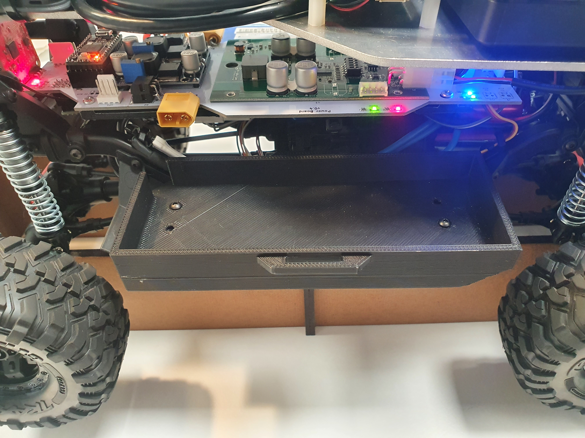
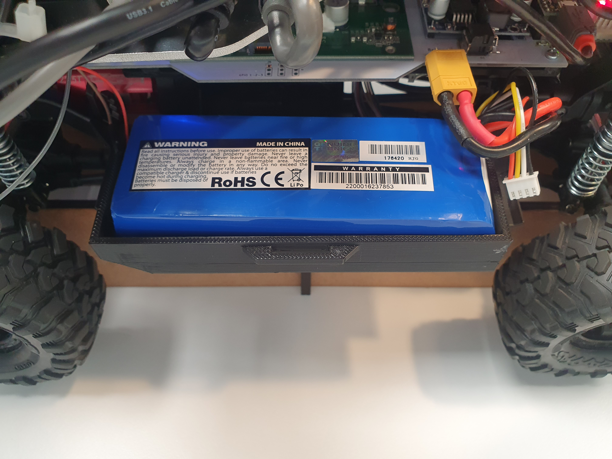
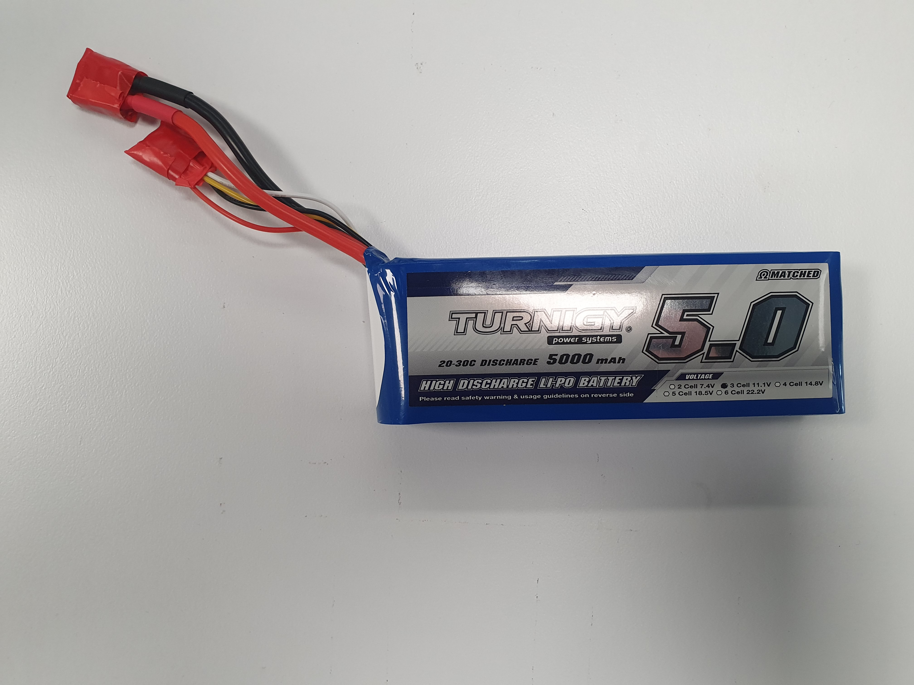

# Carlie Power Management

## Batteries
Carlie is powered using one or two 3-cell 5000mAh LiPo batteries. To plug in or replace a battery(s):

1. Lift up the shell
2. Locate the two battery slots and their respective XT60 connector on the low-level control board (white PCB). There is one battery slot/connector on either side of the vehicle.
3. Plug in one or two 3-cell LiPo batteries. *Plug in one battery if you plan on doing an extended mission (experiments longer than 1.5 hours); see [Battery Hot Swapping](#battery-hot-swapping) for details*.
4. Lower the shell, ensuring no cables or components are caught on the edge of the shell.

**Safety Warning!** LiPo batteries can be a hazard when used incorrectly. While Carlie has features to prevent LiPo misuse (e.g. over-discharge), we still recommend batteries are removed when the vehicle is not in use.

**Safety Warning!:** LiPo batteries should always be stored in a LiPo safety bag when not in use or when being charged.

**Note:** The approximate worst case run time for a single 3-cell 5000mAh battery is 2 hours.

**Note:** Carlie will automatically power off all systems when the capacity of the batteries drops too low, preventing over-discharge. This power cut-off point occurs when all batteries are approximately 9 volts.

**Note:** The Vedder Electronic Speed Control (VESC), which controls linear movement, will prevent the motor from running when the voltage is drops below 10 volts, approximately. However, the computer should remain powered until the 9 volt cut-off.

<figure float="center" style="margin-bottom: 2em; display: block; text-align: center">
    
    
</figure>

## Battery Hot Swapping
The Carlie platform has been designed with battery hot swapping capabilities. This allows a fresh battery to be plugged in without shutting down the computer; giving Carlie the ability to undertake extended missions. To hot swap batteries:

1. Plug in a fresh LiPo battery into the empty battery slot. 
2. Wait a second or two.
3. Unplug the drained LiPo battery.
4. You can now continue your experiment.

**Tip:** If you plan on running a long duration mission we recommend you power Carlie using only a single LiPo battery. The reason for this is because Carlie cannot monitor the battery charge levels independently and drains the batteries concurrently not sequentially. Hence, you may accidentally unplug the battery that Carlie is currently using and cause a computer shutdown; as the other battery may be below system shutdown voltage.

## Charging Batteries
Carlie does not have any in situ battery charging capabilities. To charge the batteries you must first remove them from the platform and then use an external charger. The Carlie platform comes standard with an EV-Peak E4, or equivalent, battery charger as well as a LiPo safety bag(s). To use this charger:

1. Turn on the EV-Peak E4 charger and wait until the blue LEDs turn on.
2. Plug in the battery balance cable, the one with the smaller white connector, into the appropriate port on the charger.
3. Place the LiPo battery into a LiPo safety bag (**important**).

It will take approximately 1.5 hours to fully charge a 5000mAh battery.

**Safety Warning!** Do not leave charging LiPo batteries unattended.

**Safety Warning!** LiPo batteries should always be stored in a LiPo safety bag when not in use or when being charged.

<figure float="center" style="margin-bottom: 2em; display: block; text-align: center">
    
</figure>

## Flying with LiPo Batteries
Flying with LiPo batteries is typically not difficult if you follow the rules. Typically, at least in Australia, the rules are as follows:

* You can take two batteries with a capacity of between 100-160 Wh
* As many batteries as you want with a capacity below 1000 Wh

**Important:** please double check with your local governing board for up to date rules.

To get the Wh rating of your battery multiple the nominal voltage (number of cells multiplied by 3.7 volts) by the number of Amp-hours (in this case 5000 milli-Amp-hours). The batteries supplied with Carlie are 55.5 Wh and so there should be no issues with taking them on a plane.

When flying with batteries you **MUST DO THE FOLLOWING:**

1. Tape the connectors, both the balance and power connectors, on the battery using electrical tape.
2. Place the batteries in a LiPo safety bag (you can have more than one battery per bag).
3. Take the batteries in your carry on baggage.
4. When going through a checkpoint take the LiPo safety bags out of your checked in baggage, much like you would a laptop. You should not need to take the batteries out of the LiPo bags, but follow the directions of all safety officers. Typically a safety office will come and check the state of the batteries, to make sure they are not dangerous (e.g. badly swollen), after they have gone through the scanner.

When flying with batteries you may be questioned about:
* Why are you taking batteries?
* Asked to take the batteries out for re-scanning.
* Subjected to an explosives test.
* The capacity of the batteries (55Wh in this case).

This is all normal, do not be concerned. Typically there are more questions about laptops or bundles of cords than LiPo batteries. Know the rules and work within them and follow all directions of the security officers and you will have no issues travelling with batteries.

<figure float="center" style="margin-bottom: 2em; display: block; text-align: center">
    
</figure>
